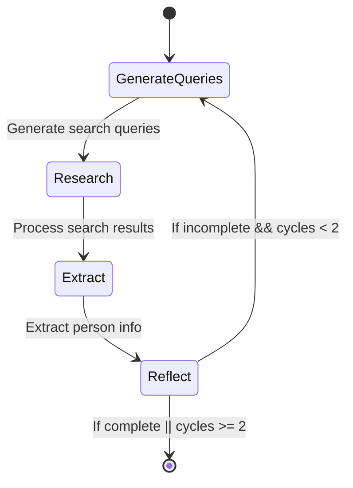

# People Researcher with Pydantic

A direct rip off of [People Researcher](https://github.com/langchain-ai/people-researcher) using [PydanticAI's Graphs](https://ai.pydantic.dev/graph).

This uses [logfire](https://pydantic.dev/logfire) for logging.

There is nothing new, this project was merely to test out Pydantic's new graph feature.

I learned about this project from [Will Pearce/moo](https://x.com/moo_hax/status/1878584494606971175) who, being a smart guy, immediately saw the benefit of the parent project for malicious use.


# Quick Run
```bash
export OPENAI_API_KEY="sk-***"
export TAVILY_API_KEY="tvly-***"
uv run people-researcher --name "John Doe" --company "ACME" --notes "Works in IT"
```

# Usage
```
usage: people-researcher [-h] [--email EMAIL] [--name NAME]
                         [--company COMPANY] [--linkedin LINKEDIN]
                         [--role ROLE] [--notes NOTES]

Research information about a person.

options:
  -h, --help           show this help message and exit
  --email EMAIL        Email address of the person
  --name NAME          Full name of the person
  --company COMPANY    Company where the person works
  --linkedin LINKEDIN  LinkedIn profile URL
  --role ROLE          Professional role or title
  --notes NOTES        Additional notes about the person
```

# Diagram


# What This Could Be
If someone did want to continue this project, I think there's a lot of cool stuff that could be done with a phishing agent/workflow. The input would be a company name, and the output would be a structured list of people that work at the company. You could then hook that up to GoPhish to perform these campaigns automatically.
Here's how you'd do that:
  - Rip out `research_person()` into a library instead of a runnable package like this
  - Modify `PersonInfo` to `CompanyUsers` with is a list of `PersonInfo` objects
  - Modify `PersonState` to be `CompanyState` and put in company name/field of work
  - Build a restricted search tool to find example emails to discover if there's an email format or just use the tool to find all emails then use internet search for discovering other attributes about that person
  - Build a tool for email validation and create a [result_validator](https://ai.pydantic.dev/results/#result-validators-functions) for that
  - Actually perform evals of the prompts to ensure those are correct, which they won't be since we're changing the purpose. Also, these prompts were designed by LangChain for Claude, not gpt-4o
  - Honestly, I'd bet you don't need a graph approach to this, so extract the nodes and probably remove the Reflect node to make things less complicated. Agent delegation should be good enough since this is a pretty simple process.
  - In `research_person()`, export the `CompanyState` object as a CSV that works with [GoPhish Bulk Import Users](https://docs.getgophish.com/user-guide/documentation/groups)
  - Run, get the user CSV, import into GoPhish, and run the campaign

You could get more complex with this and automatically build the campaign for you. It'd be interesting to have a Slack bot where you give it a company URL and a malicious payload link/attachment you want the victim to click on, and the whole campaign is built for you based on the company researched. The wild thing is that it wouldn't even be that hard to do.

If you really wanna get wild, build a new template for each user. If you wanna get even more wild, scratch GoPhish and write integrations for email, X, LinkedIn, etc and have the agent ship campaigns based on where the target user has a bigger presence.